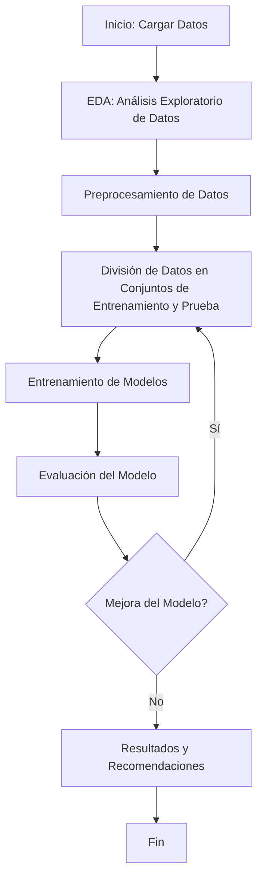

# Análisis Exploratorio y Modelado de Tasa de Cancelación de Clientes para Interconnect

[](https://www.python.org/downloads/release/python-380/)
[](#contributing)
[](#)

## 📌 Índice
- [Motivación y Objetivos](#motivación-y-objetivos)
- [Características del Proyecto](#características-del-proyecto)
- [Instalación y Configuración](#instalación-y-configuración)
- [Estructura del Proyecto](#estructura-del-proyecto)
- [Ejemplos de Uso](#ejemplos-de-uso)
- [Resultados](#resultados)
- [Contribuir](#contribuir)
- [Contacto](#contacto)

## 🎯 Motivación y Objetivos
La cancelación de clientes es un problema crítico para muchas compañías de servicios. El objetivo principal de este proyecto es reducir la tasa de cancelación, analizando qué características de los clientes influyen en la decisión de cancelar el contrato y creando modelos predictivos para identificar clientes en riesgo.

Este proyecto sigue un enfoque end-to-end para el análisis de datos y modelado predictivo:
1. Análisis Exploratorio de Datos (EDA) para identificar patrones y relaciones.
2. Modelado predictivo utilizando técnicas de Machine Learning para predecir la tasa de cancelación.
3. Evaluación y selección de modelos para determinar la mejor estrategia de retención.

# Flujo
*Diagrama del proceso de análisis de datos y modelado.*



## ✨ Características del Proyecto
- **EDA detallado**: Incluye gráficos de distribución, mapas de calor, y análisis de contingencia.
- **Múltiples modelos de clasificación**: Regresión Logística, Random Forest, XGBoost, y Redes Neuronales.
- **Métricas detalladas**: Evaluación con métricas como ROC-AUC, F1 Score, y validación cruzada para garantizar la robustez.
- **Optimización de hiperparámetros**: Se aplicó Grid Search y validación cruzada para ajustar los modelos.

## 🛠 Instalación y Configuración
Para clonar y ejecutar este proyecto, sigue los siguientes pasos:

1. **Clona el repositorio:**
   ```sh
   git clone https://github.com/tuusuario/ProyectoInterconnect.git
   cd ProyectoInterconnect
   ```
2. Crea un entorno virtual y actívalo:
   ```sh
   python -m venv venv
   source venv/bin/activate  # En Windows: venv\Scripts\activate
   ```
3. Instala las dependencias: 
   ```sh
   pip install -r requirements.txt
   ```

## 📂 Estructura del Proyecto

```plaintext
ProyectoInterconnect/
|
├── README.md                # Documentación principal del proyecto
├── data/                    # Datos crudos y procesados
│   ├── raw/                 # Datos originales
│   └── processed/           # Datos preprocesados para análisis y modelado
├── notebooks/               # Notebooks Jupyter para cada etapa
│   ├── eda.ipynb            # Análisis Exploratorio de Datos
│   ├── modeling.ipynb       # Entrenamiento de modelos
│   └── analysis_results.ipynb  # Análisis de resultados finales
├── src/                     # Código fuente
│   ├── preprocessing.py     # Preprocesamiento y limpieza de datos
│   ├── model_training.py    # Entrenamiento y evaluación de modelos
│   └── utils.py             # Funciones auxiliares
├── requirements.txt         # Dependencias del proyecto
├── .gitignore               # Archivos ignorados por Git
├── LICENSE                  # Licencia del proyecto (MIT)
└── final.pdf                # Informe del proyecto
```

## 📊 Resultados

| Modelo             | AUC-ROC | F1 Score | Exactitud |
|--------------------|---------|----------|-----------|
| Regresión Logística | 0.84    | 0.81     | 74%       |
| Random Forest      | 0.89    | 0.87     | 83%       |
| XGBoost            | 0.92    | 0.92     | 88%       |

El mejor modelo fue XGBoost con una AUC-ROC de 0.92 y un F1 Score de 0.92.

Curva ROC
Curva ROC del mejor modelo (XGBoost).

## 📨 Contacto

Si tienes preguntas, problemas o sugerencias, puedes contactarme a través de [maartin.arriola117@gmail.com].
